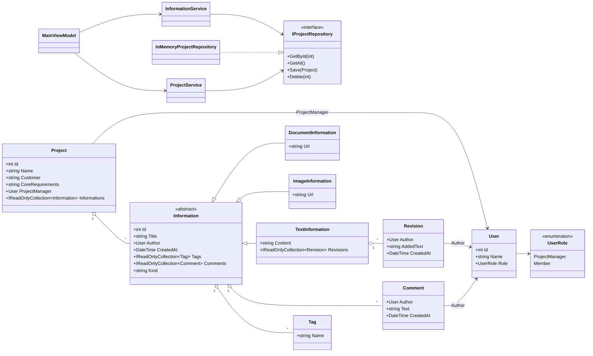

# Projektarbeit OOP – TEKO WS2025/26

## 1) Analyse nach dem roten Faden

### 1.1 Ausgangslage / Problemstellung
Die Firma **Xarelto** braucht ein einfaches Wissensmanagement fuer Projekte.  
Bisher liegen Informationen verstreut (Text, Links auf Bilder, Links auf Dokumente), sind schlecht auffindbar und Korrekturen sind nicht sauber vom Original unterscheidbar.

### 1.2 Stakeholder
- **Projektleiter (PL)**: legt Projekte an, steuert Inhalt, braucht Uebersicht.
- **Projektmitarbeiter**: erfassen und ergaenzen Informationen.
- **Dozent/Bewerter**: erwartet nachvollziehbare Analyse, Tests und Dokumentation.
- **Interne Nutzer (Demo-Zielgruppe)**: sollen den Prototypen schnell verstehen.

### 1.3 Zielsetzung (messbar)
- Projekt anlegen mit `Name`, `Kunde`, `Projektleiter`, `Kernanforderungen`.
- Information erfassen in 3 Arten: `Text`, `Bild (URL)`, `Dokument (URL)`.
- Maximal **3 Tags** pro Information.
- Kommentare und Ergaenzungen (Revisionen) erfassen, wobei Ergaenzung vom Ursprung getrennt bleibt.
- Suche nach Tag innerhalb eines Projekts.
- Prototyp bleibt fuer kleine Datenmenge geeignet (bis ca. 100 Eintraege).

### 1.4 Use-Case-Orientierung (funktionale Sicht)
- **UC1** Projekt erstellen
- **UC2** Information zum Projekt erfassen
- **UC3** Information kommentieren
- **UC4** Textinformation revidieren/ergaenzen
- **UC5** Information nach Tag suchen
- **UC6** Information loeschen
- **UC7** Projekt loeschen
- **UC8** Detailansicht Info oeffnen (Text lesen / URL oeffnen)

### 1.5 Muss-/Wunschziele
**Mussziele**
- Projektanlage mit Pflichtfeldern.
- Informationstypen Text/Bild-URL/Dokument-URL.
- Max. 3 Tags.
- Kommentieren und Revidieren (nur bei Text).
- Tag-Suche.
- Nachweis durch Testfaelle.

**Wunschziele**
- Demo-Daten laden.
- Kontextsensitive Loeschfunktion (z. B. Kontextmenue).
- Zusatzausgabe/Detailfenster fuer lange Texte und Links.
- Vollbildstart und Scrollbarkeit fuer bessere Praesentation.

### 1.6 Erkenntnisse aus der Analyse
- Ein klarer Domnenkern (`Project`, `Information`, `Tag`, `Comment`, `Revision`) verhindert chaotische UI-Logik.
- Geschaeftsregeln (z. B. max. 3 Tags, gueltige Informationsart) muessen server-/service-nah und nicht nur in der UI abgesichert sein.
- Sichtbare Trennung von Original und Ergaenzung ist mit `Revision` sauber umsetzbar.

---

## 2) Erlaeutertes Klassendiagramm (UML-nahe Darstellung)

### Erlaeuterung
- **Domain-Schicht**: enthaelt Fachlogik ohne UI-Abhaengigkeit.
- **Application-Schicht**: Services kapseln Use-Case-Logik.
- **Infrastructure-Schicht**: In-Memory-Repository als einfacher Speicher.
- **WPF/MVVM-Schicht**: ViewModel steuert Commands und Datenbindung.

---

## 3) Anforderungen und Testfaelle (geplant und durchgefuehrt)

| ID | Anforderung / Testfall | Erwartet | Ergebnis |
|---|---|---|---|
| T1 | Projekt anlegen mit gueltigen Daten | Projekt erscheint in Liste | **Bestanden** |
| T2 | Projektname doppelt anlegen | Fehlermeldung, kein Duplikat | **Bestanden** |
| T3 | Information Typ Text anlegen | Eintrag sichtbar in Projektinfos | **Bestanden** |
| T4 | Information Typ Bild-URL anlegen | Eintrag sichtbar, URL gespeichert | **Bestanden** |
| T5 | Information Typ Dokument-URL anlegen | Eintrag sichtbar, URL gespeichert | **Bestanden** |
| T6 | Mehr als 3 Tags eingeben | Nur erste 3 eindeutige Tags gespeichert | **Bestanden** |
| T7 | Keine Tags eingeben | Validierungsfehler | **Bestanden** |
| T8 | Kommentar zur ausgewaehlten Info | Kommentar erscheint im Kommentarbereich | **Bestanden** |
| T9 | Revision zu Textinfo | Revision erscheint, Text wird ergaenzt | **Bestanden** |
| T10 | Revision zu Bild/Dokument | Fehlermeldung | **Bestanden** |
| T11 | Suche nach bestehendem Tag | Trefferliste mit passenden Infos | **Bestanden** |
| T12 | Suche nach nicht vorhandenem Tag | Leere Trefferliste | **Bestanden** |
| T13 | Information loeschen | Eintrag wird entfernt | **Bestanden** |
| T14 | Projekt loeschen (Kontextmenue) | Projekt und Inhalte entfernt | **Bestanden** |
| T15 | Klick auf Info-Spalte | Detailfenster oeffnet, Link/Text einsehbar | **Bestanden** |
| T16 | Startanzeige | Fenster startet maximiert; bei Platzmangel Scrollbar | **Bestanden** |

### Testfazit
- Die Kernfunktionalitaet gemaess Aufgabenstellung ist umgesetzt und nachgewiesen.
- Nicht bestandene Faelle wurden waehrend der Entwicklung korrigiert (z. B. ComboBox-Kind-Mapping, Anzeigeprobleme, Loesch-Workflows).

---

## 4) Besondere Realisationselemente

- **MVVM-Basis** mit `ObservableObject` und `RelayCommand`.
- **Info-Detailfenster** fuer lange Inhalte und Links (Browser-Start bei URL).
- **Kontextmenue fuer Projektloeschung** (Rechtsklick in Projektliste).
- **Explizite Projekt-Details** (Name, Kunde, Kernanforderungen, PM) in der UI.
- **Mehrsprachige Konsistenz (DE)** fuer UI-Texte und Fehlermeldungen.
- **Automatische Projekt-ID-Vergabe** in der ViewModel-Logik.

---

## 5) Planung und Controlling (Anhang A, vereinfacht)

| Arbeitspaket | Geplant (h) | Ist (h) | Delta | Erkenntnis |
|---|---:|---:|---:|---|
| Analyse + Zieldefinition | 3 | 4 | +1 | Anforderungen praezisieren spart spaeter Zeit |
| Domain + Services | 5 | 6 | +1 | Fachregeln zuerst stabilisieren |
| WPF UI + MVVM | 5 | 7 | +2 | UI-Korrekturen und Binding-Themen brauchen Reserve |
| Testplanung + Durchfuehrung | 3 | 4 | +1 | Fruehe Testfaelle helfen bei Regressionen |
| Doku + Praesentation | 4 | 5 | +1 | Bewertungsraster frueh einbauen |
| **Summe** | **20** | **26** | **+6** | Delta nachvollziehbar, fachlich lehrreich |

### Lehren aus dem Delta
- Deltas sind normal; entscheidend ist die Nachvollziehbarkeit.
- Hoher Nutzen durch iterative Nachbesserung statt einmaliger Grossimplementierung.
- Fuer naechste Arbeiten mehr Puffer fuer UI-Feinschliff einplanen.

---

## 6) Abgrenzung / bekannte Grenzen

- Speicher ist **In-Memory** (keine persistente Datenbank).
- Kein Multiuser-/Berechtigungsmodell, Rollen sind fachlich modelliert, aber nicht auth-basiert.
- Prototyp fuer kleine Datenmengen gedacht (Aufgabenkontext).

---

## 7) Kurzfazit

Die Aufgabenstellung wurde funktional umgesetzt (Projektverwaltung, Informationsarten, Tags, Kommentare/Revisionen, Suche) und durch Testfaelle belegt.  
Architektur, Doku und Controlling wurden so aufgebaut, dass das erarbeitete Wissen fuer spaetere Arbeiten wiederverwendbar bleibt.

